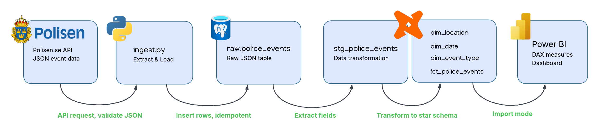
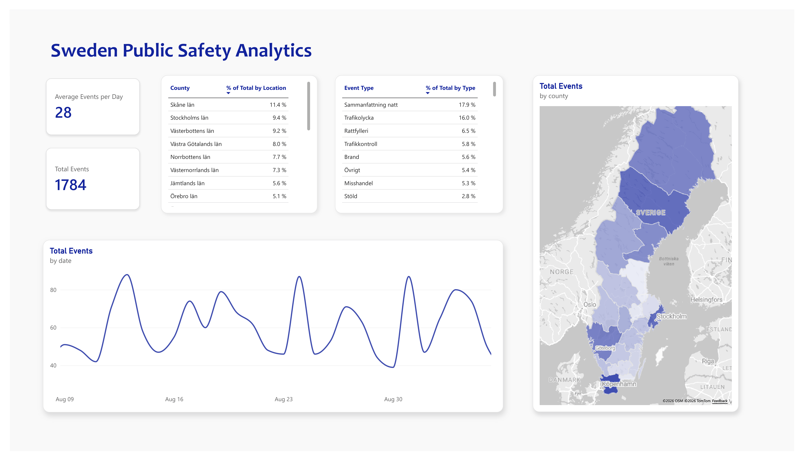

# Sweden Public Safety Analytics

An end-to-end data pipeline that ingests API data on events published by the Swedish Police Authority into a database, models the data into a dimensional model with dbt, and visualizes it in an interactive dashboard. 

This project explores patterns and derives insights from selected and published police events across Sweden. The analysis focuses on temporal, geographic, and event type distributions, based on data from the Swedish Police Authority's public API. The purpose is to demonstrate how raw operational data can be transformed into a structured analytical dataset and used to support data-driven insights.

### Architecture
The pipeline follows an ELT framework, extracting event records from the Polisen.se API, loading the raw JSON payloads into a PostgreSQL raw table, and transforming the data with dbt into a dimensional star schema. Finally, Power BI connects directly to the data warehouse, imports the tables, and presents them through DAX measures and visuals. 

<table>
  <tr>
    <td></td>
    <td></td>
  </tr>
</table>

### Dashboard & Key Insights
The resulting Power BI dashboard provides an interactive overview of public safety events across Sweden, published by the Swedish Police Authority. The visualizations enable analysis of event volume, event types, geographic distribution, and temporal patterns across the events selected for public release. Based on 1784 published events gathered over a month, the key findings from the analysis are:

- Out of the 21 counties, Skåne, Stockholm, and Västerbotten together account for approximately 30% of all published events
- “Sammanfattning natt” accounts for 17.9% of all published events, making it the single largest category despite representing a nightly summary rather than a distinct incident type
- Traffic related events ("Trafikolycka", "Rattfylleri", "Trafikkontroll") are the most frequent distinct event types
- The volume of published events varies over time, with Mondays and Thursdays showing the highest published event counts

> Note: The data represents events selected and published by the Swedish Police Authority and does not reflect the actual distribution of all police events occurring across Sweden. Additionally, county-level comparisons are not adjusted for population size.

### Skills Demonstrated
**Ingestion**
- Python
- REST API integration
- Idempotent loading with `ON CONFLICT (event_id) DO NOTHING`
- Error handling

**Engineering**
- PostgreSQL
- Raw data storage
- ELT pipeline design

**Modeling**
- dbt transformations
- Star schema with three dimensions and one fact table
- Data quality testing (`not_null`, `unique`, `relationships`)

**Analytics**
- Power BI
- DAX measures
- Interactive dashboard
- SQL-based validation of analytical findings (for weekday peaks)

### Run Locally
Clone the repository, create and activate a virtual environment, and use `.env.example` to create a `.env` file with your credentials. Then run:
1. `pip install -r requirements.txt`
2. `python ingestion/ingest.py`
3. `cd dbt`
4. `dbt build`
